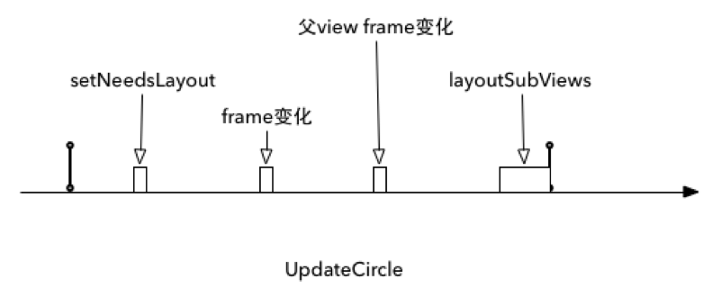

#如何布局

##布局的时候我们都需要做些什么事情
布局顾名思义，就是确定一个View的位置。也就是说我们要在布局中做的事情用一句话说就是：确定UIView的frame属性的值。给每一个UIView和其子类的实例确定frame的属性值。

##1、 初始化函数 ```- (id)initWithFrame:(CGRect)aRect```

objc构建一个对象使用的是两段式，首先分配内存```alloc```然后```init```，这样的好处就是将内存操作和初始化操作解耦合，让我们能够在初始化的时候对对象做一些必要的操作。这是个很好的思路，我们在做很多事情的时候都可以使用这种两段式的思路。比如布局一个UIView，我们可以分成两部，初始化必要的子view和变量，然后在合适的时机进行布局。

而这个两段式的第一步就是：

```
- (id)initWithFrame:(CGRect)aRect
```

这个函数是无论你用什么初始化函数都会被调用的一个，比如你用```[UIView new]```或者```[[UIView alloc] init]```都会调用initWithFrame这个函数（有些UIView的子类有特殊情况，比如UITableViewCell，怀疑apple对其做过特殊处理），所以你要是对一个view的变量有初始化的操作尽量往```initWithFrame```里面放还是非常合适的。
这样能够保证，以后在使用的时候所有的变量都被正确的初始化过。而我们一般会在```initWithFrame```中做些什么呢？

1. 添加子View
2. 初始化属性变量
3. 其他一些共用操作

所以我们一般会看到这样的代码

```
- (instancetype) initWithFrame:(CGRect)arect
{
    self = [super WithFrame:arect];
    if (!self) {
        return nil;
    }
    [self commitInit];
    <#init data#>
    return self;
}

- (void) commomInit
{
    <#common init data#>
}
```

在初花的时候将一些共用的初始化操作独立成一个函数```commomInit```然后再其中做上面说的事情，这样做的好处就是将初始化的代码集中到一起，如果你在实现的一个其他的什么initWithXXX的时候，直接调用commonInit就可以了。

不得不说的是，千万不要被这个函数的名称withFrame给忽悠了，以为这个函数使用布局用的。在代码逻辑比较清晰的工程中，几乎很少看到在这个函数中进行界面布局的工作。因为UIKit给你提供了一个专门的函数layoutSubViews来干这个事情。而且，在这个函数中做的界面布局的工作，是一次性编码，你的界面布局没有任何复用性，如果父View的大小变了之后，这个View还是傻傻的保持原来的模样。同时也会造成，初始化函数臃肿，导致维护上的困难。

##2、```layoutSubviews```和```setNeedsLayout```

上面说了一些```initWithFrame```的事情，告诫了千万不要在里面做界面布局的事情，那应该在什么地方做呢？

```
layoutSubviews
```

就是这个地方，这是苹果提供给你专门做界面布局的函数。

我们来看一下文档:

```
The default implementation of this method does nothing on iOS 5.1 and earlier. Otherwise, the default implementation uses any constraints you have set to determine the size and position of any subviews.

Subclasses can override this method as needed to perform more precise layout of their subviews. You should override this method only if the autoresizing and constraint-based behaviors of the subviews do not offer the behavior you want. You can use your implementation to set the frame rectangles of your subviews directly.

You should not call this method directly. If you want to force a layout update, call the setNeedsLayout method instead to do so prior to the next drawing update. If you want to update the layout of your views immediately, call the layoutIfNeeded method.
```

苹果都说了这个是子类化View的时候布局用的。那我们最好是老老实实的在里面做布局的工作。
#####如何布局

这是个比较有意思的话题，因为可能很多人认为很简单，绝对布局嘛就是写一些死数字嘛，直接写CGRectMake(10,10,20,20)这样的坐标不就行了。如果你真这样认为，那么下面的话可能对你有帮助。

首先，尽量不要在布局的时候直接写死数字，比较稳妥的变法是使用常亮或者宏定义，甚至你定义一个临时变量也都ok，这样代码的可维护性就会变得比较好。

其次，谁说绝对布局的框架不能写成相对布局的方式。Apple提供了一个```CGGeometry.h```的文件，里面定义了大量的方便几何布局的函数。比如CGRectGetMaxX用来获取一个View的最大x坐标。你可能会问这有什么用？我们来看段代码：

```
    _imageView.frame = CGRectMake(0, 0, width, height);
    _textLabel.frame = CGRectMake(CGRectGetMaxX(_imageView.frame), 0, CGRectGetWidth(self.frame) - CGRectGetMaxX(_imageView.frame), CGRectGetHeight(self.frame));
```
下面那个_textLabel的布局就是在_imageView的大小而确定的。这不就是一些布局管理器做的事情吗，这不就是相对布局的概念嘛。所以我们完全可以使用UIKit的几何坐标系统完成一些相对布局的事情，而且也推荐这样做。
#####什么时候布局

这个就看功能需要了，不过有一点是肯定的就是不要直接调用layoutSubviews函数。UIKit和runtime是捆绑很密切的，apple为了防止界面重新布局过于频繁，所以只在runloop合适的实际来做布局的工作。里面具体的细节，可以google。

一般你需要重新布局的时候调用```setNeedsLayout```标记一下，“我需要重新布局了”。就行了，系统会在下次runloop合适的时机给你布局。

