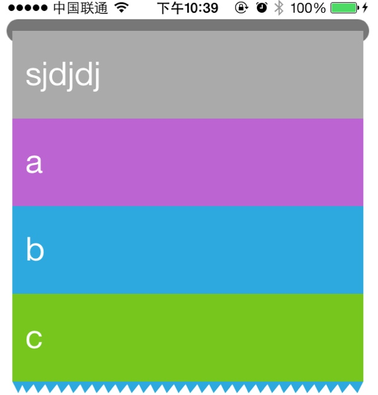

通过实现一个TableView来理解IOS UI编程
====

---

欢迎关注IOSTips微信订阅号：


---

先说点题外话。我们在日常做和IOS的UI相关的工作的时候，有一个组件的使用频率非常高--UITabelView。于是就要求我们对UITableView的每一个函数接口，每一个属性都了如指掌，只有这样在使用UITableView的时候，我们才能游刃有余的处理各种需求。不然做出来的东西，很多时候只是功能实现了，但是程序效率和代码可维护性都比较差。举个例子，比如在tableView头部要显示一段文字。我见过的最啰嗦的解决方案是这样的：

1. 子类化一个UIViewController
2. 将根View设置成一个UIScrollView
3. 把头部的Label和TableView加在ScrollView上面
4. 开始各种调整ScrollView和TableView的delegate调用函数里面的参数，让Label能随着TableView滑动

其实如果你熟悉UITableView，那么你几句话就可以搞定

```
    UILabel* label = [UILabel alloc] initWithFrame:CGRectMake(0, 0, CGRectGetWidth(self.view.frame), 40);
    label.text = @"就是一段文字嘛，干嘛大动干戈";
    tableVIew.tableHeaderView = label;
```

所谓工欲善其事必先利器，编程语言和各种库其实本质上就是工具而已。你要想用这些工具来实现产品和Leader提出的各种需求。当然，不止是功能上的实现，还包括程序效率，代码质量。特别想着重强调一下代码质量，如果你不想后面维护自己的代码就像噩梦一样，如果你不想一旦新来一个需求就得对代码大刀阔斧的伤筋动骨，如果你不想给后来者埋坑。那么最好就多注意一下。

这里的代码质量并不是简简单单的指代码写点注释了，利用Xcode提供的一些像pragam或者#warning来解释代码。《编写可阅读代码的艺术》还有其他一些编程的书籍也都说道，真正高质量的代码，是不需要注释的。一个好的代码从逻辑上和结构上都是清晰的。我看到很多很难维护的代码都是因为逻辑结构混乱，和设计模式滥用导致的程序结构紊乱。分析其原因，就会发现很多时候，是因为写代码的人对所使用的工具（主要是objc和UIKit）不是非常熟悉，于是就写了很多凑出来的临时方案，简单的实现了功能。表面看起来挺好的，但是实际上代码已经外强中，骨子里都乱了。后期维护起来会让人痛不欲生。

了解一下UITableView的一些详细的技术细节甚至是UIKit的一些技术细节对于我们写出比较好的代码，比较好的实现任务是很有必要的。我们通过实现自己的TableView来反观UIKit的UITableView，来加深我们对UITableView和UIKit的理解。在这个过程中，我们会碰到非常多非常细节的问题，而这些正是我们需要注意并且掌握的。

同时，个人一直觉得对于搞IOS开发来说自己实现一遍TableView就像是一种成人礼一样。你能够通过实现一个UITableView来深入的理解UIKit的一些技术细节，对IOS UI编程所使用到的工具，有比较深入的了解。这样，写程序的时候才不会捉襟见肘。

言归正传。开始实现一个TableView。


#一、[UIKit提供的基础](articles/Chapter0/summary.md)

#二、[实现TableView](articles/Chapter1/summary.md)
#三、[视图控制器DZTableViewController](articles/Chapter2/summary.md)
#四、[DZTableView的可扩展性探讨](articles/Chapter3/summary.md)


 


